# Vinamilk Core Ecommerce - Entity Relationship Diagram Documentation

## Table of Contents
1. [ERD Overview](#erd-overview)
2. [Core Entities](#core-entities)
3. [Relationship Types](#relationship-types)
4. [Entity Relationships](#entity-relationships)
5. [ERD Diagram (Mermaid)](#erd-diagram-mermaid)
6. [Relationship Details](#relationship-details)
7. [Database Constraints](#database-constraints)
8. [Indexing Strategy](#indexing-strategy)
9. [Normalization Analysis](#normalization-analysis)

---

## ERD Overview

### Database Schema
- **Database Name:** vinamilk
- **Engine:** MySQL 8.0+
- **Character Set:** utf8mb4
- **Collation:** utf8mb4_unicode_ci
- **Total Tables:** 60+
- **Total Relationships:** 100+

### ERD Notation
- **1:1** - One-to-One relationship
- **1:N** - One-to-Many relationship
- **M:N** - Many-to-Many relationship
- **(FK)** - Foreign Key
- **(PK)** - Primary Key
- **(UQ)** - Unique Key
- **(IX)** - Index

---

## Core Entities

### User & Authentication
- **users** - Customer and admin users
- **admin_users** - Admin panel users
- **roles** - User roles (Spatie)
- **permissions** - Granular permissions (Spatie)
- **role_has_permissions** - Role-permission pivot
- **model_has_permissions** - Model-permission pivot
- **model_has_roles** - Model-role pivot
- **personal_access_tokens** - API tokens (Sanctum)
- **password_reset_tokens** - Password reset tokens

### Product Catalog
- **categories** - Product categories
- **brands** - Product brands
- **product_lines** - Product lines/groups
- **products** - Main product catalog
- **product_variants** - Product variants
- **product_images** - Product images
- **product_attributes** - Product attributes
- **flavors** - Product flavors
- **sugar_levels** - Sugar content levels
- **packaging_types** - Packaging types
- **volumes** - Product volumes
- **age_groups** - Target age groups
- **nutritional_needs** - Nutritional requirements
- **certificates** - Product certifications

### Order Management
- **orders** - Customer orders
- **order_items** - Order line items
- **order_status_logs** - Order status history
- **carts** - Shopping carts
- **cart_items** - Cart line items
- **wishlists** - User wishlists

### Payment & Logistics
- **payments** - Payment transactions
- **payment_logs** - Payment transaction logs
- **payment_methods** - Available payment methods
- **shipping_methods** - Available shipping methods
- **stores** - Physical store locations
- **addresses** - User addresses

### Marketing & Promotion
- **coupons** - Discount coupons
- **vouchers** - Gift vouchers
- **promotion_campaigns** - Marketing campaigns
- **promotion_flash_sales** - Flash sale events
- **promotion_banners** - Promotional banners
- **marketing_rules** - Marketing rules
- **marketing_rule_conditions** - Rule conditions
- **marketing_rule_rewards** - Rule rewards
- **marketing_rule_user_usages** - User usage tracking
- **marketing_gifts** - Marketing gifts
- **rewards** - Customer reward points
- **reward_redemptions** - Reward redemption history

### Content Management
- **blog_posts** - Blog articles
- **blog_categories** - Blog categories
- **banners** - Website banners
- **mega_menus** - Mega menu structure

### Care & Subscription
- **care_products** - Care program products
- **care_subscriptions** - Customer subscriptions
- **care_delivery_options** - Delivery options
- **care_greeting_cards** - Greeting cards
- **care_page_settings** - Page settings

### Activity & Logging
- **activity_logs** - User activity tracking
- **audit_logs** - System audit logs
- **chat_messages** - AI chat messages
- **chat_knowledge** - Chat knowledge base
- **chat_settings** - Chat configuration

### Multi-tenancy
- **tenants** - Tenant/Store configuration

---

## Relationship Types

### One-to-One (1:1)
- users ↔ personal_access_tokens (rare, usually 1:N)
- orders ↔ payments (usually 1:N, but can be 1:1 for single payment)

### One-to-Many (1:N)
- tenants → users
- tenants → products
- tenants → orders
- users → orders
- users → addresses
- users → carts
- users → wishlists
- categories → products
- brands → products
- product_lines → products
- products → product_variants
- products → product_images
- products → order_items
- orders → order_items
- orders → payments
- orders → order_status_logs
- carts → cart_items
- blog_categories → blog_posts

### Many-to-Many (M:N)
- users ↔ roles (via model_has_roles)
- roles ↔ permissions (via role_has_permissions)
- products ↔ certificates (via pivot table)
- products ↔ age_groups (via product_attributes)
- products ↔ nutritional_needs (via product_attributes)
- orders ↔ coupons (via coupon_code reference)

---

## Entity Relationships

### User & Authentication Relationships

```
users (PK: id)
├── 1:N → orders (FK: user_id)
├── 1:N → addresses (FK: user_id)
├── 1:N → carts (FK: user_id)
├── 1:N → wishlists (FK: user_id)
├── 1:N → activity_logs (FK: user_id)
├── 1:N → audit_logs (FK: user_id)
├── 1:N → chat_messages (FK: user_id)
├── M:N → roles (via model_has_roles)
└── M:N → permissions (via model_has_permissions)

admin_users (PK: id)
├── 1:N → activity_logs (FK: user_id)
├── M:N → roles (via model_has_roles)
└── M:N → permissions (via model_has_permissions)

roles (PK: id)
├── M:N → users (via model_has_roles)
├── M:N → admin_users (via model_has_roles)
└── M:N → permissions (via role_has_permissions)

permissions (PK: id)
└── M:N → roles (via role_has_permissions)
```

### Product Catalog Relationships

```
categories (PK: id)
├── 1:N → products (FK: category_id)
├── 1:N → product_lines (FK: category_id)
└── 1:N → blog_categories (self-reference: parent_id)

brands (PK: id)
└── 1:N → products (FK: brand_id)

product_lines (PK: id)
└── 1:N → products (FK: product_line_id)

products (PK: id)
├── N:1 → categories (FK: category_id)
├── N:1 → brands (FK: brand_id)
├── N:1 → product_lines (FK: product_line_id)
├── N:1 → tenants (FK: tenant_id)
├── 1:N → product_variants (FK: product_id)
├── 1:N → product_images (FK: product_id)
├── 1:N → product_attributes (FK: product_id)
├── 1:N → order_items (FK: product_id)
├── 1:N → cart_items (FK: product_id)
├── 1:N → wishlists (FK: product_id)
└── M:N → certificates (via pivot)

product_variants (PK: id)
├── N:1 → products (FK: product_id)
├── N:1 → flavors (FK: flavor_id)
├── N:1 → sugar_levels (FK: sugar_level_id)
├── N:1 → packaging_types (FK: packaging_type_id)
├── 1:N → product_images (FK: product_variant_id)
├── 1:N → order_items (FK: product_variant_id)
└── 1:N → cart_items (FK: product_variant_id)

product_images (PK: id)
├── N:1 → products (FK: product_id)
└── N:1 → product_variants (FK: product_variant_id)

product_attributes (PK: id)
└── N:1 → products (FK: product_id)
```

### Order Management Relationships

```
orders (PK: id)
├── N:1 → users (FK: user_id)
├── N:1 → tenants (FK: tenant_id)
├── N:1 → addresses (FK: shipping_address_id)
├── N:1 → shipping_methods (FK: shipping_method_id)
├── N:1 → payment_methods (FK: payment_method_id)
├── N:1 → vouchers (FK: voucher_id)
├── 1:N → order_items (FK: order_id)
├── 1:N → payments (FK: order_id)
└── 1:N → order_status_logs (FK: order_id)

order_items (PK: id)
├── N:1 → orders (FK: order_id)
├── N:1 → products (FK: product_id)
└── N:1 → product_variants (FK: product_variant_id)

order_status_logs (PK: id)
├── N:1 → orders (FK: order_id)
└── N:1 → users (FK: changed_by)

carts (PK: id)
├── N:1 → users (FK: user_id)
├── N:1 → tenants (FK: tenant_id)
└── 1:N → cart_items (FK: cart_id)

cart_items (PK: id)
├── N:1 → carts (FK: cart_id)
├── N:1 → products (FK: product_id)
└── N:1 → product_variants (FK: product_variant_id)

wishlists (PK: id)
├── N:1 → users (FK: user_id)
└── N:1 → products (FK: product_id)
```

### Payment & Logistics Relationships

```
payments (PK: id)
├── N:1 → orders (FK: order_id)
├── N:1 → payment_methods (FK: payment_method_id)
└── 1:N → payment_logs (FK: payment_id)

payment_logs (PK: id)
└── N:1 → payments (FK: payment_id)

payment_methods (PK: id)
├── 1:N → payments (FK: payment_method_id)
└── 1:N → orders (FK: payment_method_id)

shipping_methods (PK: id)
└── 1:N → orders (FK: shipping_method_id)

stores (PK: id)
├── N:1 → tenants (FK: tenant_id)
└── 1:N → orders (as pickup location)

addresses (PK: id)
├── N:1 → users (FK: user_id)
└── 1:N → orders (FK: shipping_address_id)
```

### Marketing & Promotion Relationships

```
coupons (PK: id)
└── 1:N → orders (via coupon_code)

vouchers (PK: id)
└── 1:N → orders (FK: voucher_id)

promotion_campaigns (PK: id)
├── 1:N → promotion_flash_sales (FK: campaign_id)
└── 1:N → promotion_banners (FK: campaign_id)

promotion_flash_sales (PK: id)
├── N:1 → promotion_campaigns (FK: campaign_id)
└── M:N → product_variants (via pivot)

marketing_rules (PK: id)
├── 1:N → marketing_rule_conditions (FK: marketing_rule_id)
├── 1:N → marketing_rule_rewards (FK: marketing_rule_id)
└── 1:N → marketing_rule_user_usages (FK: marketing_rule_id)

marketing_gifts (PK: id)
└── 1:N → marketing_rule_rewards (FK: marketing_gift_id)

rewards (PK: id)
├── N:1 → users (FK: user_id)
└── 1:N → reward_redemptions (FK: reward_id)

reward_redemptions (PK: id)
├── N:1 → rewards (FK: reward_id)
└── N:1 → users (FK: user_id)
```

### Content Management Relationships

```
blog_posts (PK: id)
├── N:1 → blog_categories (FK: category_id)
├── N:1 → users (FK: author_id)
└── M:N → blog_tags (via pivot)

blog_categories (PK: id)
├── 1:N → blog_posts (FK: category_id)
└── 1:N → blog_categories (self-reference: parent_id)

mega_menus (PK: id)
├── 1:N → mega_menus (self-reference: parent_id)
└── N:1 → products (via featured_product_id)
```

### Care & Subscription Relationships

```
care_products (PK: id)
└── 1:N → care_subscriptions (FK: care_product_id)

care_subscriptions (PK: id)
├── N:1 → users (FK: user_id)
└── N:1 → care_products (FK: care_product_id)
```

### Activity & Logging Relationships

```
activity_logs (PK: id)
└── N:1 → users (FK: user_id)

audit_logs (PK: id)
└── N:1 → users (FK: user_id)

chat_messages (PK: id)
└── N:1 → users (FK: user_id)
```

### Multi-tenancy Relationships

```
tenants (PK: id)
├── 1:N → users (FK: tenant_id)
├── 1:N → products (FK: tenant_id)
├── 1:N → orders (FK: tenant_id)
├── 1:N → carts (FK: tenant_id)
└── 1:N → stores (FK: tenant_id)
```

---

## ERD Diagram (Mermaid)

### Complete ERD

```mermaid
erDiagram
    %% User & Authentication
    users ||--o{ orders : "places"
    users ||--o{ addresses : "has"
    users ||--o{ carts : "has"
    users ||--o{ wishlists : "has"
    users ||--o{ activity_logs : "performs"
    users ||--o{ audit_logs : "audits"
    users ||--o{ chat_messages : "sends"
    users }o--o{ roles : "has"
    roles }o--o{ permissions : "has"
    
    admin_users ||--o{ activity_logs : "performs"
    admin_users }o--o{ roles : "has"
    
    %% Product Catalog
    categories ||--o{ products : "contains"
    categories ||--o{ product_lines : "has"
    categories ||--o{ categories : "parent of"
    
    brands ||--o{ products : "manufactures"
    product_lines ||--o{ products : "groups"
    
    products ||--o{ product_variants : "has"
    products ||--o{ product_images : "has"
    products ||--o{ product_attributes : "has"
    products ||--o{ order_items : "ordered as"
    products ||--o{ cart_items : "in cart"
    products ||--o{ wishlists : "in wishlist"
    products }o--o{ certificates : "certified by"
    
    product_variants ||--o{ product_images : "has"
    product_variants ||--o{ order_items : "ordered as"
    product_variants ||--o{ cart_items : "in cart"
    product_variants }o--|| flavors : "has"
    product_variants }o--|| sugar_levels : "has"
    product_variants }o--|| packaging_types : "has"
    
    %% Order Management
    orders ||--o{ order_items : "contains"
    orders ||--o{ payments : "has"
    orders ||--o{ order_status_logs : "logs"
    orders }o--|| users : "placed by"
    orders }o--|| addresses : "shipped to"
    orders }o--|| shipping_methods : "uses"
    orders }o--|| payment_methods : "pays with"
    orders }o--|| vouchers : "uses"
    
    order_items }o--|| orders : "belongs to"
    order_items }o--|| products : "for"
    order_items }o--|| product_variants : "for"
    
    carts ||--o{ cart_items : "contains"
    carts }o--|| users : "belongs to"
    
    cart_items }o--|| carts : "belongs to"
    cart_items }o--|| products : "for"
    cart_items }o--|| product_variants : "for"
    
    wishlists }o--|| users : "belongs to"
    wishlists }o--|| products : "contains"
    
    %% Payment & Logistics
    payments ||--o{ payment_logs : "logs"
    payments }o--|| orders : "for"
    payments }o--|| payment_methods : "uses"
    
    payment_methods ||--o{ payments : "used in"
    payment_methods ||--o{ orders : "used in"
    
    shipping_methods ||--o{ orders : "used in"
    
    stores ||--o{ orders : "pickup from"
    stores }o--|| tenants : "belongs to"
    
    addresses }o--|| users : "belongs to"
    addresses ||--o{ orders : "used in"
    
    %% Marketing & Promotion
    coupons ||--o{ orders : "applied to"
    vouchers ||--o{ orders : "applied to"
    
    promotion_campaigns ||--o{ promotion_flash_sales : "has"
    promotion_campaigns ||--o{ promotion_banners : "has"
    
    promotion_flash_sales }o--|| promotion_campaigns : "belongs to"
    promotion_flash_sales }o--o{ product_variants : "includes"
    
    marketing_rules ||--o{ marketing_rule_conditions : "has"
    marketing_rules ||--o{ marketing_rule_rewards : "has"
    marketing_rules ||--o{ marketing_rule_user_usages : "tracks"
    
    marketing_gifts ||--o{ marketing_rule_rewards : "given as"
    
    rewards ||--o{ reward_redemptions : "redeemed"
    rewards }o--|| users : "belongs to"
    
    reward_redemptions }o--|| rewards : "for"
    reward_redemptions }o--|| users : "by"
    
    %% Content Management
    blog_posts ||--o{ blog_categories : "in"
    blog_posts }o--|| users : "authored by"
    
    blog_categories ||--o{ blog_posts : "contains"
    blog_categories ||--o{ blog_categories : "parent of"
    
    mega_menus ||--o{ mega_menus : "parent of"
    mega_menus }o--|| products : "features"
    
    %% Care & Subscription
    care_products ||--o{ care_subscriptions : "in"
    care_subscriptions }o--|| users : "for"
    care_subscriptions }o--|| care_products : "for"
    
    %% Activity & Logging
    activity_logs }o--|| users : "by"
    audit_logs }o--|| users : "by"
    chat_messages }o--|| users : "by"
    
    %% Multi-tenancy
    tenants ||--o{ users : "has"
    tenants ||--o{ products : "has"
    tenants ||--o{ orders : "has"
    tenants ||--o{ carts : "has"
    tenants ||--o{ stores : "has"
```



---

## Relationship Details

### User-Order Relationship
**Type:** One-to-Many (1:N)
**Foreign Key:** orders.user_id → users.id
**On Delete:** SET NULL (preserve order history)
**Cascade:** No
**Description:** A user can place multiple orders, but an order belongs to one user.

### Product-Category Relationship
**Type:** Many-to-One (N:1)
**Foreign Key:** products.category_id → categories.id
**On Delete:** SET NULL (preserve product)
**Cascade:** No
**Description:** A product belongs to one category, a category can have multiple products.

### Product-Variant Relationship
**Type:** One-to-Many (1:N)
**Foreign Key:** product_variants.product_id → products.id
**On Delete:** CASCADE (variants depend on product)
**Cascade:** Yes
**Description:** A product can have multiple variants (size, flavor, packaging).

### Order-OrderItem Relationship
**Type:** One-to-Many (1:N)
**Foreign Key:** order_items.order_id → orders.id
**On Delete:** CASCADE (items depend on order)
**Cascade:** Yes
**Description:** An order can have multiple items, an item belongs to one order.

### Order-Payment Relationship
**Type:** One-to-Many (1:N)
**Foreign Key:** payments.order_id → orders.id
**On Delete:** RESTRICT (preserve payment history)
**Cascade:** No
**Description:** An order can have multiple payments (partial payments), a payment belongs to one order.

### User-Role Relationship (Spatie)
**Type:** Many-to-Many (M:N)
**Pivot Table:** model_has_roles
**Foreign Keys:** 
- model_has_roles.role_id → roles.id
- model_has_roles.model_id → users.id
**On Delete:** CASCADE
**Cascade:** Yes
**Description:** A user can have multiple roles, a role can be assigned to multiple users.

### Role-Permission Relationship (Spatie)
**Type:** Many-to-Many (M:N)
**Pivot Table:** role_has_permissions
**Foreign Keys:**
- role_has_permissions.permission_id → permissions.id
- role_has_permissions.role_id → roles.id
**On Delete:** CASCADE
**Cascade:** Yes
**Description:** A role can have multiple permissions, a permission can be assigned to multiple roles.

---

## Database Constraints

### Primary Key Constraints
All tables have a primary key `id` (BIGINT UNSIGNED AUTO_INCREMENT).

### Foreign Key Constraints

#### users table
```sql
FOREIGN KEY (tenant_id) REFERENCES tenants(id) ON DELETE SET NULL
```

#### products table
```sql
FOREIGN KEY (tenant_id) REFERENCES tenants(id) ON DELETE SET NULL
FOREIGN KEY (category_id) REFERENCES categories(id) ON DELETE SET NULL
FOREIGN KEY (brand_id) REFERENCES brands(id) ON DELETE SET NULL
FOREIGN KEY (product_line_id) REFERENCES product_lines(id) ON DELETE SET NULL
```

#### product_variants table
```sql
FOREIGN KEY (product_id) REFERENCES products(id) ON DELETE CASCADE
FOREIGN KEY (flavor_id) REFERENCES flavors(id) ON DELETE SET NULL
FOREIGN KEY (sugar_level_id) REFERENCES sugar_levels(id) ON DELETE SET NULL
FOREIGN KEY (packaging_type_id) REFERENCES packaging_types(id) ON DELETE SET NULL
```

#### orders table
```sql
FOREIGN KEY (tenant_id) REFERENCES tenants(id) ON DELETE SET NULL
FOREIGN KEY (user_id) REFERENCES users(id) ON DELETE SET NULL
FOREIGN KEY (shipping_address_id) REFERENCES addresses(id) ON DELETE SET NULL
FOREIGN KEY (shipping_method_id) REFERENCES shipping_methods(id) ON DELETE SET NULL
FOREIGN KEY (payment_method_id) REFERENCES payment_methods(id) ON DELETE SET NULL
FOREIGN KEY (voucher_id) REFERENCES vouchers(id) ON DELETE SET NULL
```

### Unique Constraints

#### users table
```sql
UNIQUE KEY users_email_unique (email)
```

#### products table
```sql
UNIQUE KEY products_slug_unique (slug)
UNIQUE KEY products_sku_unique (sku)
```

#### product_variants table
```sql
UNIQUE KEY product_variants_sku_unique (sku)
```

#### roles table (Spatie)
```sql
UNIQUE KEY roles_name_guard_name_unique (name, guard_name)
```

#### permissions table (Spatie)
```sql
UNIQUE KEY permissions_name_guard_name_unique (name, guard_name)
```

#### wishlists table
```sql
UNIQUE KEY wishlists_user_id_product_id_unique (user_id, product_id)
```

### Check Constraints

#### products table
```sql
CHECK (price >= 0)
CHECK (compare_price IS NULL OR compare_price >= price)
```

#### product_variants table
```sql
CHECK (price >= 0)
CHECK (stock_quantity >= 0)
```

#### orders table
```sql
CHECK (subtotal >= 0)
CHECK (discount >= 0)
CHECK (shipping_fee >= 0)
CHECK (total >= 0)
```

---

## Indexing Strategy

### Primary Indexes
All tables have primary key indexes on `id`.

### Foreign Key Indexes
All foreign key columns are automatically indexed by MySQL.

### Additional Indexes

#### users table
```sql
INDEX idx_users_email (email)
INDEX idx_users_phone (phone)
INDEX idx_users_is_active (is_active)
```

#### products table
```sql
INDEX idx_products_slug (slug)
INDEX idx_products_sku (sku)
INDEX idx_products_category_id (category_id)
INDEX idx_products_brand_id (brand_id)
INDEX idx_products_is_active (is_active)
INDEX idx_products_is_featured (is_featured)
INDEX idx_products_created_at (created_at)
INDEX idx_products_category_active (category_id, is_active)
```

#### product_variants table
```sql
INDEX idx_product_variants_sku (sku)
INDEX idx_product_variants_product_id (product_id)
INDEX idx_product_variants_is_active (is_active)
INDEX idx_product_variants_is_default (is_default)
```

#### orders table
```sql
INDEX idx_orders_order_number (order_number)
INDEX idx_orders_user_id (user_id)
INDEX idx_orders_status (status)
INDEX idx_orders_created_at (created_at)
INDEX idx_orders_user_status (user_id, status)
INDEX idx_orders_status_created (status, created_at)
```

#### order_items table
```sql
INDEX idx_order_items_order_id (order_id)
INDEX idx_order_items_product_id (product_id)
INDEX idx_order_items_product_variant_id (product_variant_id)
```

#### activity_logs table
```sql
INDEX idx_activity_logs_user_id (user_id)
INDEX idx_activity_logs_resource_type (resource_type)
INDEX idx_activity_logs_created_at (created_at)
INDEX idx_activity_logs_user_created (user_id, created_at)
```

### Composite Indexes
Composite indexes are used for frequently queried column combinations:
- `idx_products_category_active` - Filter by category and active status
- `idx_orders_user_status` - Filter user orders by status
- `idx_activity_logs_user_created` - Filter user activities by date

### Full-Text Indexes
For search functionality on text fields:
```sql
FULLTEXT INDEX ft_products_name (name)
FULLTEXT INDEX ft_products_description (description)
FULLTEXT INDEX ft_blog_posts_title (title)
FULLTEXT INDEX ft_blog_posts_content (content)
```

---

## Normalization Analysis

### First Normal Form (1NF)
- All tables have primary keys
- All columns are atomic (no repeating groups)
- All rows are unique

### Second Normal Form (2NF)
- All tables are in 1NF
- All non-key attributes are fully dependent on the primary key
- No partial dependencies

### Third Normal Form (3NF)
- All tables are in 2NF
- No transitive dependencies
- All non-key attributes depend only on the primary key

### Denormalization (Performance Optimization)
Some intentional denormalization for performance:
- **product_variants.price** - Stored in variants for quick access (could be calculated from base price + modifiers)
- **orders.subtotal, total** - Stored for quick access (could be calculated from items)
- **categories.sort_order** - Stored for ordering (could use separate table)

---

## Relationship Cardinality Summary

### High Cardinality Relationships (1:N with many children)
- users → orders (average 10-100 orders per user)
- products → product_variants (average 5-20 variants per product)
- products → product_images (average 3-10 images per product)
- orders → order_items (average 2-10 items per order)

### Medium Cardinality Relationships (1:N with moderate children)
- categories → products (average 20-100 products per category)
- brands → products (average 50-200 products per brand)
- orders → payments (average 1-3 payments per order)

### Low Cardinality Relationships (1:N with few children)
- users → addresses (average 1-5 addresses per user)
- users → carts (average 1-2 carts per user)
- products → product_attributes (average 2-5 attributes per product)

### Many-to-Many Relationships (M:N)
- users ↔ roles (average 1-3 roles per user)
- roles ↔ permissions (average 10-50 permissions per role)
- products ↔ certificates (average 1-5 certificates per product)

---

## Data Integrity Rules

### Referential Integrity
- All foreign key constraints enforce referential integrity
- ON DELETE CASCADE for dependent entities
- ON DELETE SET NULL for optional relationships
- ON DELETE RESTRICT for critical relationships

### Domain Integrity
- ENUM columns enforce allowed values
- CHECK constraints enforce business rules
- DECIMAL columns enforce precision
- DATE/DATETIME columns enforce valid dates

### Entity Integrity
- Primary keys ensure unique row identification
- Unique constraints prevent duplicate values
- NOT NULL constraints ensure required fields

---

## Performance Considerations

### Query Optimization
- Use indexes for frequently queried columns
- Use composite indexes for multi-column queries
- Use covering indexes for common query patterns
- Avoid SELECT * in production queries

### Join Optimization
- Use INNER JOIN for required relationships
- Use LEFT JOIN for optional relationships
- Use subqueries sparingly (prefer JOINs)
- Use EXISTS instead of IN for subqueries

### Partitioning Strategy (Future)
- Partition orders by date range
- Partition activity_logs by date range
- Partition chat_messages by date range

### Archival Strategy
- Archive old orders (> 2 years)
- Archive old activity logs (> 1 year)
- Archive old chat messages (> 6 months)

---

## ERD Tools

### Recommended Tools
- **MySQL Workbench** - Visual ERD design and reverse engineering
- **dbdiagram.io** - Online ERD tool with Mermaid support
- **Lucidchart** - Professional diagramming tool
- **Draw.io** - Free diagramming tool
- **Mermaid.js** - Text-based diagramming (used in this doc)

### Reverse Engineering
To generate ERD from existing database:
```bash
# Using MySQL Workbench
Database > Reverse Engineer

# Using SchemaSpy
java -jar schemaSpy.jar -t mysql -u user -p password -d vinamilk

# Using dbdiagram.io
Export schema as SQL and import to dbdiagram.io
```

---

## ERD Maintenance

### Version Control
- Store ERD in version control (Git)
- Use Mermaid format for text-based versioning
- Document changes in CHANGELOG.md

### Update Process
1. Update database schema (migration)
2. Update ERD diagram
3. Update documentation
4. Review with team
5. Commit changes

### Review Schedule
- Quarterly ERD review
- After major schema changes
- Before new feature development
