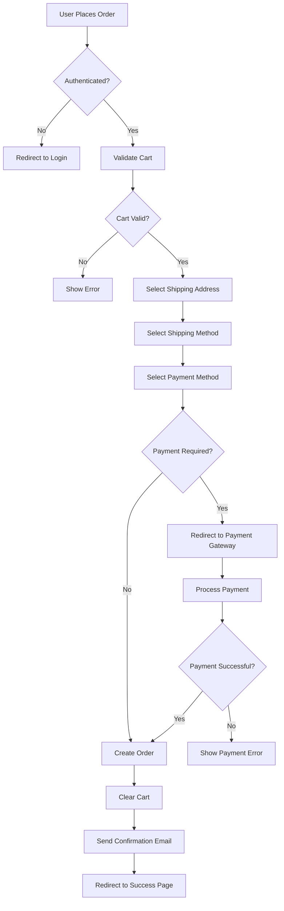
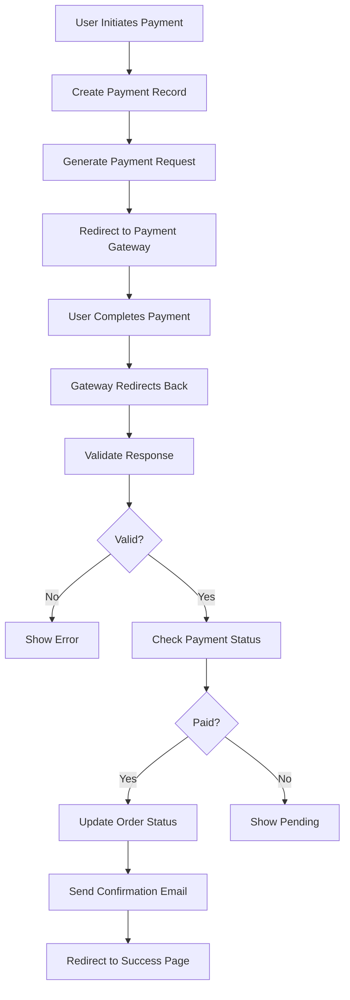
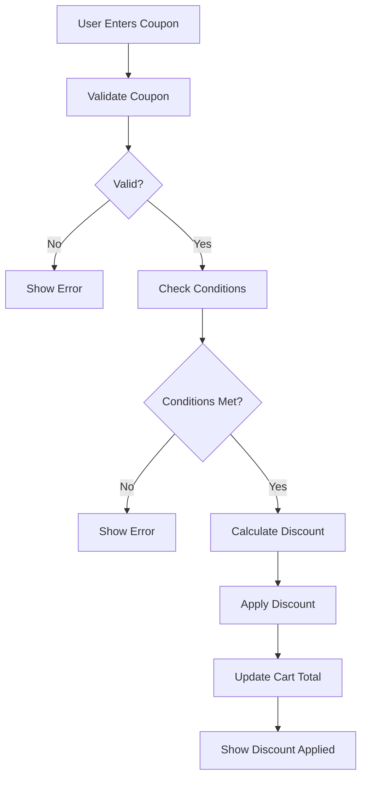

# Vinamilk Core Ecommerce - System Flows Documentation

## Table of Contents
1. [System Flow Overview](#system-flow-overview)
2. [User Authentication Flow](#user-authentication-flow)
3. [Product Browsing Flow](#product-browsing-flow)
4. [Shopping Cart Flow](#shopping-cart-flow)
5. [Order Processing Flow](#order-processing-flow)
6. [Payment Processing Flow](#payment-processing-flow)
7. [Shipping Flow](#shipping-flow)
8. [Promotion Application Flow](#promotion-application-flow)
9. [Care Program Flow](#care-program-flow)
10. [Admin Order Management Flow](#admin-order-management-flow)
11. [Error Handling Flow](#error-handling-flow)

---

## System Flow Overview

### Flow Diagram Notation
- **→** : Data flow / Process step
- **[ ]** : Decision point
- **( )** : External system
- **⬇** : Sequential flow
- **⬅** : Return flow

### System Flow Categories
1. **Customer Flows** - User-facing processes
2. **Admin Flows** - Admin panel processes
3. **Integration Flows** - Third-party integrations
4. **Background Flows** - Queue-based processes

---

## User Authentication Flow

### Registration Flow

```
User → Register Page
    ↓
Enter: Name, Email, Phone, Password
    ↓
[Validate Input]
    ↓ Yes → [Check Email Exists]
    ↓ No → Show Validation Errors
    ↓ Yes → Show "Email already exists"
    ↓ No → Create User Record
    ↓
Generate JWT Token
    ↓
Send Welcome Email (Queue)
    ↓
Return: Token + User Data
    ↓
Redirect to Home / Onboarding
```

### Login Flow

```
User → Login Page
    ↓
Enter: Email, Password
    ↓
[Validate Input]
    ↓ Yes → [Authenticate User]
    ↓ No → Show Validation Errors
    ↓ Yes → [Check Account Status]
    ↓ No → Show "Invalid credentials"
    ↓ Yes → Generate JWT Token
    ↓ No → Show "Account inactive"
    ↓
Store Token in LocalStorage
    ↓
Update Last Login Timestamp
    ↓
Return: Token + User Data
    ↓
Redirect to Previous Page / Home
```

### Logout Flow

```
User → Click Logout
    ↓
[Confirm Logout]
    ↓ Yes → Remove Token from LocalStorage
    ↓ No → Cancel
    ↓
Invalidate Token on Server
    ↓
Clear User Session Data
    ↓
Redirect to Login Page
```

### Password Reset Flow

```
User → Forgot Password Page
    ↓
Enter: Email
    ↓
[Validate Email]
    ↓ Yes → [Check Email Exists]
    ↓ No → Show Validation Error
    ↓ Yes → Generate Reset Token
    ↓ No → Show "Email not found"
    ↓
Send Reset Email (Queue)
    ↓
Return: "Check your email"
    ↓
User → Click Reset Link in Email
    ↓
[Validate Token]
    ↓ Yes → Show Reset Password Form
    ↓ No → Show "Invalid/Expired token"
    ↓
Enter: New Password, Confirm Password
    ↓
[Validate Password]
    ↓ Yes → Update Password
    ↓ No → Show Validation Error
    ↓
Invalidate Reset Token
    ↓
Return: "Password updated successfully"
    ↓
Redirect to Login Page
```

---

## Product Browsing Flow

### Home Page Load Flow

```
User → Access Home Page
    ↓
[Check Cache]
    ↓ Yes → Return Cached Data
    ↓ No → Fetch Home Data
    ↓
Parallel Fetch:
    - Featured Products
    - Banners
    - Categories
    - Mega Menu
    ↓
[Cache Data] (24h)
    ↓
Render Home Page
    ↓
Load Images (Lazy)
    ↓
Track Page View (Analytics)
```

### Product Search Flow

```
User → Enter Search Query
    ↓
[Debounce Input] (300ms)
    ↓
Fetch Search Suggestions
    ↓
Display Suggestions Dropdown
    ↓
User → Select Suggestion OR Press Enter
    ↓
Fetch Search Results
    ↓
Apply Filters (if any):
    - Category
    - Price Range
    - Brand
    ↓
Sort Results (if selected):
    - Price (ASC/DESC)
    - Newest
    - Popular
    ↓
Paginate Results (20 per page)
    ↓
Render Product Grid
    ↓
Track Search Query (Analytics)
```

### Product Detail Flow

```
User → Click Product
    ↓
[Check Cache]
    ↓ Yes → Return Cached Data
    ↓ No → Fetch Product Data
    ↓
Fetch:
    - Product Details
    - Product Variants
    - Product Images
    - Related Products
    - Reviews
    ↓
[Cache Data] (1h)
    ↓
Render Product Page
    ↓
User → Select Variant
    ↓
Update Price & Stock Display
    ↓
User → Add to Cart
    ↓
[Check Authentication]
    ↓ Yes → Add to Cart (API)
    ↓ No → Add to Cart (LocalStorage)
    ↓
Show "Added to Cart" Toast
    ↓
Update Cart Count in Header
```

---

## Shopping Cart Flow

### Add to Cart Flow

```
User → Click "Add to Cart"
    ↓
[Check Authentication]
    ↓ Yes → [Check Cart Exists]
    ↓ No → Create Cart (LocalStorage)
    ↓ Yes → [Check Item in Cart]
    ↓ No → Add Item to Cart (API)
    ↓ Yes → Update Quantity (API)
    ↓ No → Add Item to Cart (LocalStorage)
    ↓ Yes → Update Quantity (LocalStorage)
    ↓
Calculate Cart Total
    ↓
[Apply Promotions]
    ↓
Update Cart Display
    ↓
Show Success Message
    ↓
Update Cart Badge Count
```

### Cart Page Flow

```
User → Access Cart Page
    ↓
[Check Authentication]
    ↓ Yes → Fetch Cart from API
    ↓ No → Load Cart from LocalStorage
    ↓
Render Cart Items
    ↓
User → Update Quantity
    ↓
[Check Stock]
    ↓ Yes → Update Quantity
    ↓ No → Show "Out of stock"
    ↓
Recalculate Total
    ↓
User → Remove Item
    ↓
Remove from Cart
    ↓
Recalculate Total
    ↓
User → Apply Coupon
    ↓
[Validate Coupon]
    ↓ Yes → Apply Discount
    ↓ No → Show Error Message
    ↓
User → Proceed to Checkout
    ↓
[Check Cart Empty]
    ↓ Yes → Redirect to Checkout
    ↓ No → Show "Cart is empty"
```

---

## Order Processing Flow

### Checkout Flow

```
User → Proceed to Checkout
    ↓
[Check Authentication]
    ↓ Yes → Continue
    ↓ No → Redirect to Login/Register
    ↓
Load Checkout Data:
    - Cart Items
    - User Addresses
    - Shipping Methods
    - Payment Methods
    ↓
Step 1: Shipping Address
    ↓
User → Select/Add Address
    ↓
Validate Address
    ↓
Calculate Shipping Fee
    ↓
Step 2: Shipping Method
    ↓
User → Select Shipping Method
    ↓
Update Shipping Fee
    ↓
Step 3: Payment Method
    ↓
User → Select Payment Method
    ↓
[Check Payment Gateway]
    ↓ Yes → Load Payment Form
    ↓ No → Show COD Option
    ↓
Step 4: Review Order
    ↓
Display Order Summary:
    - Items
    - Subtotal
    - Discount
    - Shipping Fee
    - Total
    ↓
User → Confirm Order
    ↓
[Validate Order]
    ↓ Yes → Create Order (API)
    ↓ No → Show Validation Errors
    ↓
[Payment Required?]
    ↓ Yes → Redirect to Payment Gateway
    ↓ No → Order Created Successfully
    ↓
Clear Cart
    ↓
Send Order Confirmation Email (Queue)
    ↓
Redirect to Order Success Page
```

### Order Status Flow

```
Order Created → Pending
    ↓
[Payment Received?]
    ↓ Yes → Confirmed
    ↓ No → Cancel (after timeout)
    ↓
Confirmed → Processing
    ↓
[Inventory Check]
    ↓ Yes → Reserve Stock
    ↓ No → Backorder / Cancel
    ↓
Processing → Ready to Ship
    ↓
[Create Shipping Label]
    ↓
[Call Shipping API]
    ↓
Ready to Ship → Shipped
    ↓
[Tracking Number Assigned]
    ↓
Shipped → In Transit
    ↓
[Delivery Updates from Carrier]
    ↓
In Transit → Delivered
    ↓
[Delivery Confirmation]
    ↓
Send Delivery Notification (Queue)
    ↓
Delivered → Completed
```

---

## Payment Processing Flow

### VNPay Payment Flow

```
User → Select VNPay Payment
    ↓
Create Payment Record
    ↓
Generate Payment Request
    ↓
[Build VNPay Parameters]
    ↓
- Amount
    ↓
- Order Info
    ↓
- Return URL
    ↓
- IP Address
    ↓
Generate Secure Hash
    ↓
Redirect to VNPay Gateway
    ↓
User → Complete Payment on VNPay
    ↓
VNPay → Redirect to Return URL
    ↓
[Validate VNPay Response]
    ↓ Yes → [Check Payment Status]
    ↓ No → Show "Payment failed"
    ↓ Yes → Update Order Status: Paid
    ↓ No → Show "Payment pending"
    ↓
Update Payment Record
    ↓
Send Payment Confirmation Email (Queue)
    ↓
Redirect to Payment Success Page
```

### MoMo Payment Flow

```
User → Select MoMo Payment
    ↓
Create Payment Record
    ↓
Generate MoMo Payment Request
    ↓
[Build MoMo Parameters]
    ↓
- Amount
    ↓
- Order Info
    ↓
- Return URL
    ↓
- Notify URL
    ↓
Generate Signature
    ↓
Redirect to MoMo Gateway
    ↓
User → Complete Payment on MoMo
    ↓
MoMo → Redirect to Return URL
    ↓
[Validate MoMo Response]
    ↓ Yes → [Check Payment Status]
    ↓ No → Show "Payment failed"
    ↓ Yes → Update Order Status: Paid
    ↓ No → Show "Payment pending"
    ↓
Update Payment Record
    ↓
Send Payment Confirmation Email (Queue)
    ↓
Redirect to Payment Success Page
```

### COD Payment Flow

```
User → Select COD Payment
    ↓
Create Order with Payment Status: Pending
    ↓
Display Order Success Page
    ↓
Send Order Confirmation Email (Queue)
    ↓
[Order Delivered]
    ↓
[Collect Cash Payment]
    ↓
Update Payment Status: Paid
    ↓
Send Payment Confirmation Email (Queue)
```

### Payment Webhook Flow

```
Payment Gateway → Send Webhook
    ↓
[Validate Webhook Signature]
    ↓ Yes → Process Webhook
    ↓ No → Reject Webhook
    ↓
[Find Payment by Transaction ID]
    ↓ Yes → [Check Payment Status]
    ↓ No → Create Payment Record
    ↓ Yes → [Already Paid?]
    ↓ No → Update Payment Status
    ↓ Yes → Skip (Duplicate)
    ↓
Update Order Status
    ↓
Send Notifications (Queue)
    ↓
Return 200 OK
```

---

## Shipping Flow

### Shipping Fee Calculation Flow

```
User → Select Shipping Address
    ↓
[Get Province, District, Ward]
    ↓
[Calculate Cart Weight]
    ↓
[Get Cart Value]
    ↓
Fetch Shipping Methods
    ↓
[For Each Shipping Method]
    ↓
Calculate Base Fee
    ↓
[Apply Distance Fee]
    ↓
[Apply Weight Fee]
    ↓
[Apply Free Shipping Threshold]
    ↓
[Apply Promotion Discount]
    ↓
Return Final Fee
    ↓
Display Shipping Options
```

### Order Shipping Flow

```
Order Confirmed → Ready to Ship
    ↓
[Select Shipping Method]
    ↓
[Generate Shipping Label]
    ↓
[Call Shipping API]
    ↓
GHN API:
    - Create Order
    - Get Tracking Number
    ↓
[Update Order with Tracking Number]
    ↓
[Send SMS Notification] (Queue)
    ↓
Order → Shipped
    ↓
[Track Shipment]
    ↓
[Carrier Webhook Updates]
    ↓
Update Order Status
    ↓
[Send Status Notifications] (Queue)
    ↓
Order → Delivered
```

### Shipping Status Sync Flow

```
Carrier → Send Status Webhook
    ↓
[Validate Webhook Signature]
    ↓ Yes → Process Update
    ↓ No → Reject
    ↓
[Find Order by Tracking Number]
    ↓ Yes → [Check Status Change]
    ↓ No → Create Order (if new)
    ↓ Yes → Update Order Status
    ↓
[Log Status Change]
    ↓
[Send Notification] (Queue)
    ↓
Return 200 OK
```

---

## Promotion Application Flow

### Coupon Validation Flow

```
User → Enter Coupon Code
    ↓
[Validate Coupon Format]
    ↓ Yes → [Check Coupon Exists]
    ↓ No → Show "Invalid coupon code"
    ↓ Yes → [Check Coupon Active]
    ↓ No → Show "Coupon not active"
    ↓ Yes → [Check Validity Period]
    ↓ No → Show "Coupon expired"
    ↓ Yes → [Check Usage Limit]
    ↓ No → Show "Coupon usage limit reached"
    ↓ Yes → [Check User Usage]
    ↓ No → Show "Coupon already used"
    ↓ Yes → [Check Minimum Order Value]
    ↓ No → Show "Minimum order not met"
    ↓ Yes → Calculate Discount
    ↓
Apply Discount to Cart
    ↓
Update Cart Total
    ↓
Show Discount Applied
```

### Marketing Rules Engine Flow

```
Cart → Evaluate Marketing Rules
    ↓
[Fetch Active Rules]
    ↓
[For Each Rule]
    ↓
[Check Rule Conditions]
    ↓ Yes → [Check Rule Priority]
    ↓ No → Skip Rule
    ↓ Yes → Apply Rule Rewards
    ↓ No → Skip Rule
    ↓
[Calculate Best Discount]
    ↓
Apply Best Discount
    ↓
[Log Rule Application]
    ↓
Update Cart Total
    ↓
Show Applied Promotions
```

### Flash Sale Flow

```
User → View Flash Sale Page
    ↓
[Check Flash Sale Active]
    ↓ Yes → Display Flash Sale Products
    ↓ No → Show "Flash sale ended"
    ↓
[Check Stock Availability]
    ↓
Display:
    - Product
    - Flash Price
    - Original Price
    - Stock Remaining
    ↓
User → Add to Cart
    ↓
[Check Flash Stock]
    ↓ Yes → Add to Cart
    ↓ No → Show "Out of stock"
    ↓
[Check Purchase Limit]
    ↓ Yes → Add to Cart
    ↓ No → Show "Purchase limit reached"
    ↓
Update Flash Sale Stock
    ↓
[Stock Depleted?]
    ↓ Yes → End Flash Sale
    ↓ No → Continue
```

---

## Care Program Flow

### Care Program Subscription Flow

```
User → Access Care Page
    ↓
Load Care Products
    ↓
Load Delivery Options
    ↓
Load Greeting Cards
    ↓
User → Select Products
    ↓
User → Select Delivery Option
    ↓
User → Select Greeting Card
    ↓
[Enter Recipient Details]
    ↓
[Enter Delivery Schedule]
    ↓
Calculate Total Price
    ↓
User → Confirm Subscription
    ↓
[Check Authentication]
    ↓ Yes → Create Subscription
    ↓ No → Redirect to Login
    ↓
Create Care Order
    ↓
Process Payment
    ↓
Send Confirmation Email (Queue)
    ↓
Redirect to Subscription Success Page
```

### Care Delivery Flow

```
Subscription Created → Active
    ↓
[Check Delivery Schedule]
    ↓
[Generate Delivery Order]
    ↓
[Create Order]
    ↓
[Process Payment]
    ↓
[Prepare Delivery]
    ↓
[Assign Delivery Driver]
    ↓
[Send Delivery Notification] (Queue)
    ↓
Delivery → In Progress
    ↓
[Track Delivery]
    ↓
Delivery → Completed
    ↓
[Send Completion Notification] (Queue)
    ↓
[Check Subscription End Date]
    ↓ Yes → End Subscription
    ↓ No → Schedule Next Delivery
```

---

## Admin Order Management Flow

### Admin Order Processing Flow

```
Admin → Access Order Management
    ↓
Load Orders List
    ↓
[Apply Filters]
    - Status
    - Date Range
    - Customer
    ↓
Admin → Select Order
    ↓
Load Order Details
    ↓
Admin → Review Order
    ↓
[Update Order Status]
    ↓
[Log Status Change]
    ↓
[Send Notification] (Queue)
    ↓
[Status = Cancelled?]
    ↓ Yes → [Refund Payment?]
    ↓ No → Continue
    ↓ Yes → Process Refund
    ↓
[Restore Stock]
    ↓
[Status = Shipped?]
    ↓ Yes → [Generate Shipping Label]
    ↓ No → Continue
    ↓
[Call Shipping API]
    ↓
[Update Tracking Number]
    ↓
[Send SMS Notification] (Queue)
```

### Admin Inventory Management Flow

```
Admin → Access Inventory Management
    ↓
Load Product Inventory
    ↓
[Apply Filters]
    - Category
    - Low Stock
    - Out of Stock
    ↓
Admin → Update Stock
    ↓
[Validate Stock Value]
    ↓ Yes → Update Stock
    ↓ No → Show Error
    ↓
[Stock = 0?]
    ↓ Yes → [Auto-disable Product?]
    ↓ No → Continue
    ↓ Yes → Disable Product
    ↓
[Log Stock Change]
    ↓
[Send Low Stock Alert] (Queue)
```

### Admin Promotion Management Flow

```
Admin → Access Promotion Management
    ↓
Load Active Promotions
    ↓
Admin → Create New Promotion
    ↓
[Enter Promotion Details]
    - Name
    - Type
    - Conditions
    - Rewards
    - Validity Period
    ↓
[Validate Promotion]
    ↓ Yes → Save Promotion
    ↓ No → Show Errors
    ↓
[Activate Promotion]
    ↓
[Clear Promotion Cache]
    ↓
Send Promotion Notification (Queue)
```

---

## Error Handling Flow

### API Error Handling Flow

```
API Call → [Response Received]
    ↓
[Check HTTP Status]
    ↓ 2xx → Success
    ↓ 4xx → Client Error
    ↓ 5xx → Server Error
    ↓
[4xx Error]
    ↓ 400 → Bad Request → Show "Invalid request"
    ↓ 401 → Unauthorized → Redirect to Login
    ↓ 403 → Forbidden → Show "Access denied"
    ↓ 404 → Not Found → Show "Resource not found"
    ↓ 422 → Validation Error → Show validation errors
    ↓ 429 → Rate Limit → Show "Too many requests"
    ↓
[5xx Error]
    ↓ Show "Server error"
    ↓
[Log Error] (Sentry)
    ↓
[Show User-Friendly Message]
    ↓
[Offer Retry Option]
```

### Payment Error Handling Flow

```
Payment Processing → [Error Occurred]
    ↓
[Check Error Type]
    ↓
[Insufficient Funds]
    ↓ Show "Insufficient funds"
    ↓
[Payment Gateway Error]
    ↓ Show "Payment gateway error"
    ↓
[Network Error]
    ↓ Show "Network error, please retry"
    ↓
[Timeout Error]
    ↓ Show "Payment timeout, please retry"
    ↓
[Log Error] (Sentry)
    ↓
[Update Payment Status: Failed]
    ↓
[Send Error Notification] (Queue)
    ↓
[Offer Retry Option]
```

### Shipping Error Handling Flow

```
Shipping API Call → [Error Occurred]
    ↓
[Check Error Type]
    ↓
[Invalid Address]
    ↓ Show "Invalid shipping address"
    ↓
[Service Unavailable]
    ↓ Show "Shipping service unavailable"
    ↓
[Rate Limit]
    ↓ Retry after delay
    ↓
[Log Error] (Sentry)
    ↓
[Update Order Status: Error]
    ↓
[Send Error Notification] (Queue)
    ↓
[Offer Alternative Shipping Method]
```

---

## Background Job Flows

### Email Sending Flow

```
Event Triggered → Queue Email Job
    ↓
[Job Picked by Worker]
    ↓
[Load Email Template]
    ↓
[Render Email Content]
    ↓
[Send Email via SMTP/SendGrid]
    ↓
[Email Sent Successfully?]
    ↓ Yes → [Log Success]
    ↓ No → [Retry] (3 attempts)
    ↓
[Still Failed?]
    ↓ Yes → [Log Failure]
    ↓ [Alert Admin]
    ↓ No → [Mark as Sent]
```

### SMS Sending Flow

```
Event Triggered → Queue SMS Job
    ↓
[Job Picked by Worker]
    ↓
[Load SMS Template]
    ↓
[Render SMS Content]
    ↓
[Send SMS via Gateway]
    ↓
[SMS Sent Successfully?]
    ↓ Yes → [Log Success]
    ↓ No → [Retry] (3 attempts)
    ↓
[Still Failed?]
    ↓ Yes → [Log Failure]
    ↓ [Alert Admin]
    ↓ No → [Mark as Sent]
```

### Cache Refresh Flow

```
[Schedule: Every Hour]
    ↓
[Refresh Product Cache]
    ↓
[Refresh Category Cache]
    ↓
[Refresh Promotion Cache]
    ↓
[Refresh Menu Cache]
    ↓
[Log Cache Refresh]
```

---

## Data Synchronization Flows

### Product Sync Flow

```
Admin → Update Product
    ↓
[Update Database]
    ↓
[Clear Product Cache]
    ↓
[Update Search Index]
    ↓
[Update CDN Cache]
    ↓
[Log Product Update]
    ↓
[Send Webhook] (if configured)
```

### Inventory Sync Flow

```
Order Created → [Reserve Stock]
    ↓
[Update Product Stock]
    ↓
[Clear Product Cache]
    ↓
[Check Low Stock Threshold]
    ↓ Yes → [Send Low Stock Alert]
    ↓ No → Continue
    ↓
Order Cancelled → [Restore Stock]
    ↓
[Update Product Stock]
    ↓
[Clear Product Cache]
```

---

## Security Flows

### Token Refresh Flow

```
API Call → [Token Expired?]
    ↓ Yes → [Use Refresh Token]
    ↓ No → Continue
    ↓
[Refresh Token Valid?]
    ↓ Yes → [Generate New Access Token]
    ↓ No → [Redirect to Login]
    ↓
[Store New Token]
    ↓
[Retry Original Request]
```

### Rate Limiting Flow

```
API Request → [Check Rate Limit]
    ↓
[Within Limit?]
    ↓ Yes → Process Request
    ↓ No → [Return 429]
    ↓
[Set Retry-After Header]
    ↓
[Log Rate Limit Exceeded]
```

---

## Analytics Flows

### Page View Tracking Flow

```
User → Access Page
    ↓
[Track Page View]
    ↓
[Send to Analytics]
    ↓
[Track User Session]
    ↓
[Track Referrer]
    ↓
[Track Device Info]
```

### Event Tracking Flow

```
User Action → [Track Event]
    ↓
[Event: Add to Cart]
    ↓
[Send to Analytics]
    ↓
[Track Product ID]
    ↓
[Track Quantity]
    ↓
[Track Cart Value]
```

### Conversion Tracking Flow

```
Order Completed → [Track Conversion]
    ↓
[Send to Analytics]
    ↓
[Track Order Value]
    ↓
[Track Order Items]
    ↓
[Track User Info]
    ↓
[Track Attribution]
```

---

## Flow Diagrams (Mermaid)

### Order Processing Flow Diagram



### Payment Processing Flow Diagram



### Promotion Application Flow Diagram



---

## Flow Optimization

### Performance Optimizations
- **Caching:** Cache frequently accessed data
- **Queue Processing:** Offload heavy tasks to queues
- **Lazy Loading:** Load data only when needed
- **Batch Processing:** Process items in batches
- **Parallel Processing:** Execute independent tasks in parallel

### Error Recovery
- **Retry Logic:** Automatic retry for transient failures
- **Fallback Mechanisms:** Alternative paths for failures
- **Circuit Breakers:** Prevent cascading failures
- **Dead Letter Queues:** Handle failed jobs
- **Monitoring:** Track flow performance

---

## Monitoring & Logging

### Flow Monitoring
- **Track Flow Duration:** Measure execution time
- **Track Success Rate:** Monitor flow success/failure
- **Track Error Rates:** Monitor error occurrences
- **Alert on Thresholds:** Alert on performance degradation

### Logging Strategy
- **Log Flow Start:** Log when flow starts
- **Log Flow Steps:** Log each step in flow
- **Log Flow Completion:** Log when flow completes
- **Log Errors:** Log all errors with context
- **Log Performance:** Log performance metrics

---

## Future Enhancements

### Planned Flow Improvements
- [ ] Implement real-time order tracking
- [ ] Add AI-powered product recommendations
- [ ] Implement one-click checkout
- [ ] Add multi-warehouse inventory sync
- [ ] Implement dynamic pricing
- [ ] Add subscription management flows
